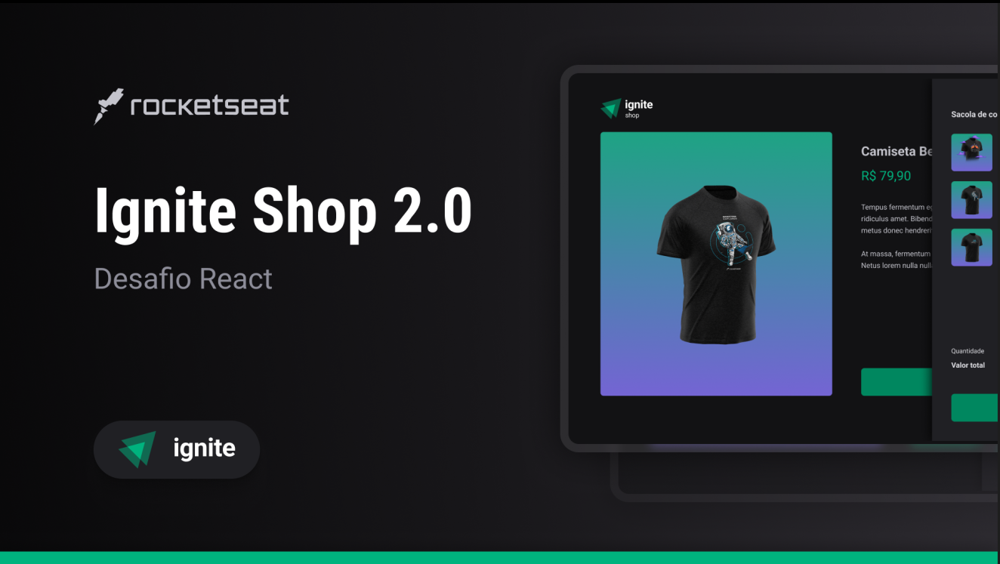

# Ignite Shop 2.0

Esta aplicação foi desenvolvida a partir do desafio do treinamento de ReactJS da Rocketseat, 
o desafio proposto foi implementar um carrinho de compras no projeto desenvolvido em um dos capítulos do treinamento, 
porém decidi refatorar todo projeto com as features mais recentes do Next.JS 14 com App Router, ou seja, 
uma arquitetura totalmente diferente, mais atual e adequada para projetos next.js para os dias atuais, foi um grande desafio.
No desenvolvimento do projeto utilizei o [TailwindCSS](https://tailwindcss.com/) para estilização, no qual 
se tornou a biblioteca de estilização padrão para projetos next.js, 
[Phosphor](https://phosphoricons.com/) para ícones, [Radix UI](https://www.radix-ui.com/primitives) para desenvolver o menu de uma forma mais ágil, [Redux Toolkit](https://redux-toolkit.js.org/) para o gerenciamento de estado, 
[Keen-slider](https://keen-slider.io/), uma biblioteca que ajuda na criação de slides, 
[Stripe](https://stripe.com/), como integração para meios de pagamentos, [T3 Env](https://env.t3.gg/) com o objetivo de tipagem de variáveis de ambiente, [tailwind-merge](https://github.com/dcastil/tailwind-merge), biblioteca que a auxilia na criação de componentes.
Algo que venho utilizando bastante é a biblioteca da rocketseat [eslint-config-rocketseat](https://github.com/Rocketseat/eslint-config-rocketseat) como uma boa configuração ESlint e formatação com Prettier.


#### Plus +

- Responsividade (Mobile First)
- Testes end-to-end com [Cypress](https://www.cypress.io/) (Os testes não estão 100%, pois não consegui realizar o teste do checkout com a confirmação de envio dos items)
- Persistência de dados com [Redux Persist](https://github.com/rt2zz/redux-persist) para armazenar os items no carrinho de compras mesmo quando atualiza a página ou fecha o navegador.


### Funcionalidades:

- Adicionar item ao carrinho.

- Remover item do carrinho.

- Slide de produtos

- Checkout com a confirmação de envio

- Página de confirmação de envio


## Tecnologias Utilizadas


## Inicializar a aplicação:


Caso tenha interesse em clonar o repositório favor seguir as seguites instruções:

Criar um arquivo .env.local com o seguinte código no qual você pode inserir seu próprio perfil no github e respositório selecionado da sua escolha
```javascript

# Caminho da url raíz da aplicação
NEXT_PUBLIC_VERCEL_URL_APP

# sua secret key no stripe
NEXT_PUBLIC_VERCEL_ENV_STRIPE_SECRET_KEY

```

Para inicializar a aplicação utilizar os comandos
```javascript
npm install
npm run dev

	or

yarn install
yarn dev
```

## A aplicação está hospedada na Vercel
[https://ignite-trilha2022-desafio04-adicionando-features-ao-ignite-shop.vercel.app/](https://ignite-trilha2022-desafio04-adicionando-features-ao-ignite-shop.vercel.app/)
